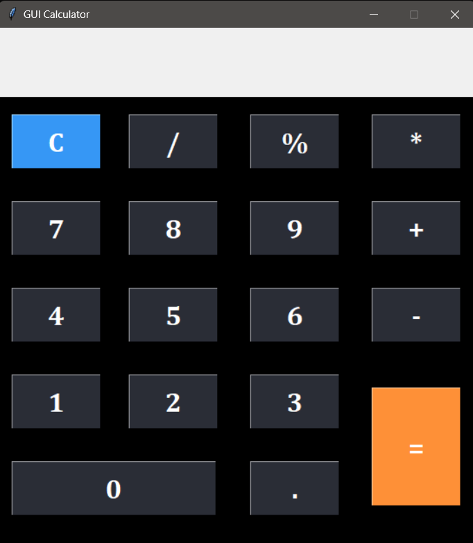

# GUI Calculator
<b>Summary:</b>

Project displays a calculator with very basic arithmetic operations. The operations are as follows:

<ol><li>Add</li><li>Subtract</li><li>Multiply</li><li>Divide</li><li>Modulus</li><li>Clear</li></ol>
 
<b>How to use code:</b>
 

Download zip and then run the file gui_calculator.py

 
<b>How code should run:</b>

