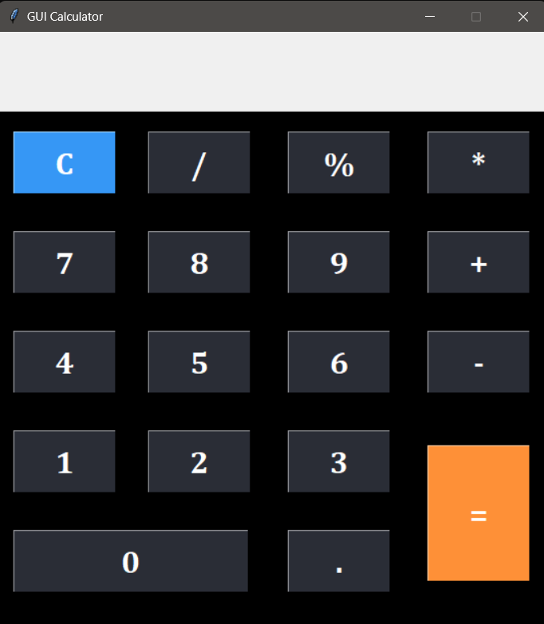

# GUI Calculator
## Summary:

Project displays a calculator with very basic arithmetic operations. The operations are as follows:

<ol><li>Add</li><li>Subtract</li><li>Multiply</li><li>Divide</li><li>Modulus</li><li>Clear</li></ol>
 

## How to use:
 

Download zip/ Clone repo and then run the file gui_calculator.py

 

## How code should run:
 

